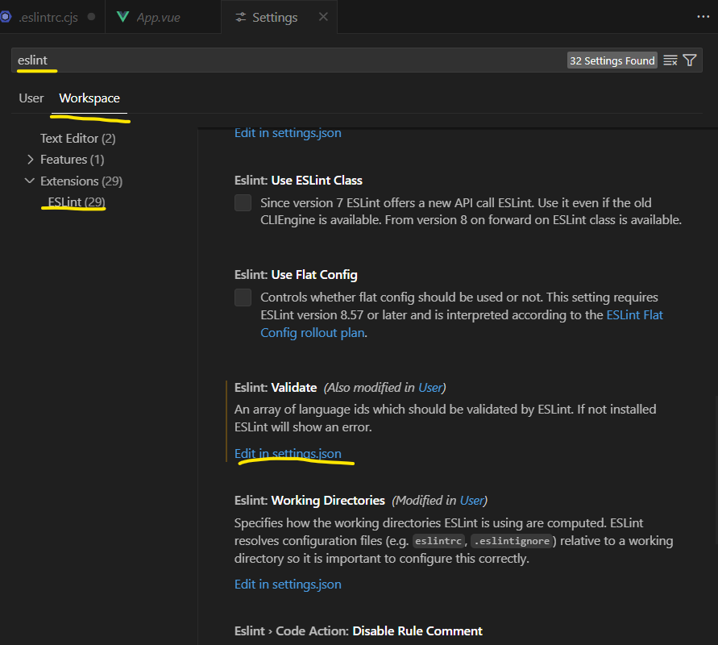
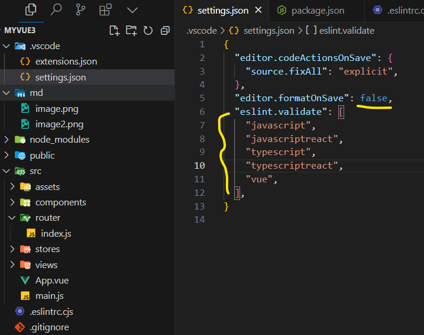

# myvue3
## Vue 프로젝트 생성 과정

1. Vite Vue 프로젝트 생성
   ```
   npm init vue
   ```

2. 프로젝트 설정
   - Project name: vue-project
   - Add TypeScript? No
   - Add JSX Support? No
   - Add Vue Router for Single Page Application development? Yes
   - Add Pinia for state management? Yes
   - Add Vitest for Unit Testing? No
   - Add an End-to-End Testing Solution? No
   - Add ESLint for code quality? Yes
   - Add Prettier for code formatting? Yes

3. 프로젝트 디렉토리로 이동 및 종속성 설치
   ```
   cd vue-project
   npm install
   ```

4. 코드 포맷팅
   ```
   npm run format
   ```

5. 개발 서버 실행
   ```
   npm run dev
   ```


## Vue 프로젝트 eslint 기본 설정.

1. .eslintrc.cjs 파일 수정.
```
module.exports = {
  root: true,
  'extends': [
    'plugin:vue/vue3-essential',
    'eslint:recommended',
    '@vue/eslint-config-prettier'     //  '@vue/eslint-config-prettier/skip-formatting'  skip-formatting 을 제거
  ],
  parserOptions: {
    ecmaVersion: 'latest'
  },
  rules: {
		'no-console': process.env.NODE_ENV === 'production' ? 'warn' : 'off',
      // prettier 설정 적용
		'prettier/prettier': [
			'error',
			{
				singleQuote: true,
				semi: true,
				useTabs: true,
				tabWidth: 2,
				trailingComma: 'all',
				printWidth: 80,
				bracketSpacing: true,
				arrowParens: 'always',
			},
		],
	},
```
2. prettier 를 eslint option에 설정함에 따라 .prettierrc.json 파일은 불필요 합니다. 삭제 처리 합니다.


3. settings.json 파일 수정.

CTRL+, > eslint 검색 > ESlint 선택 > 하단에 ESlint: Validate  Edit in settings.json 클릭 




```
{
  "editor.codeActionsOnSave": {
    "source.fixAll": "explicit", 
  },
  "editor.formatOnSave": false, 
  "eslint.validate": [
    "javascript",
    "javascriptreact",
    "typescript",
    "typescriptreact", 
    "vue",
  ],  
}

```

4. package.json 파일 수정.
prettier는 lint를 이용하여 lint에서 대신 처리해 줌으로서 format 명령어를 따로 사용하지 않음.

```
"scripts": {
  "lint": "eslint . --ext .vue,.js,.jsx,.cjs,.mjs --fix --ignore-path .gitignore",
  // "format": "prettier --write src/"  ( 제거해 준다. )
}
```

5. 설정된 포맷 전체 파일 반영
```
npm run lint
```

** 이후 저장시에 설정된 포맷에 맞도록 자동 수정됨. **

## Vue 프로젝트 기본파일 초기화.
### 기반이 되는 코드 만들기. 


